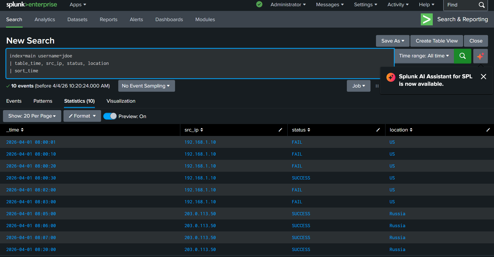

## Suspicious Login Investigation

This project demonstrates how authentication log analysis in Splunk can be used to detect brute-force attacks and account compromise through behavioral analysis.

### Scenario
An alert indicated multiple failed login attempts followed by a successful login for a user account. The objective was to determine whether the activity represented a potential account compromise.

### Key Skills Demonstrated
- SIEM investigation using Splunk.
- Log analysis and query development.
- Detection of brute force attack patterns.
- Identification of account compromise.
- Behavioral analysis of authentication events.

### Tools Used
- Splunk (SIEM)

### Investigation Process
1. Queried authentication logs to identify the most active users.
2. Identified `jdoe` as the user with the highest login activity.
3. Filtered logs to isolate activity for the user.
4. Analyzed login attempts over time.
5. Observed multiple failed login attempts followed by a successful login.
6. Identified continued failed attempts after successful authentication.
7. Detected a change in IP address and geographic location.

### Sample Queries

#### User Activity Timeline

`index=main username=jdoe
| table _time, src_ip, status, location
| sort _time`

This query was used to display the sequence of login events for the user, allowing identification of failed login attempts, successful authentication, IP address changes, and geographic anomalies over time.

`index=main username=jdoe
| stats count by status`

This query was used to quantify failed versus successful login attempts, helping to quantify brute-force activity and support the conclusion of account compromise

### Findings
- Multiple failed login attempts were observed for user `jdoe`.
- A successful login occurred after several failed attempts.
- Additional failed login attempts continued after the successful authentication.
- Initial activity originated from IP `192.168.1.10` (US).
- Subsequent successful logins originated from IP `203.0.113.50` (Russia).
- The geographic location changed within a short time frame.
- Failed login attempts continued after successful authentication, indicating automated attack behavior rather than normal user activity.

### Behavioral Indicators
- Repeated failed login attempts (brute force pattern).
- Successful authentication following multiple failures.
- Continued failed attempts after successful login.
- Sudden change in IP address.
- Geographic location anomaly (US → Russia).

### Interpretation
The presence of continued failed login attempts after a successful authentication strongly indicates automated brute-force or password spraying activity, as legitimate users do not continue to generate failed login attempts after successfully authenticating.

The subsequent successful logins from a different IP address and geographic location indicate a likely account compromise. The rapid transition between locations suggests unauthorized access rather than legitimate user activity.

### Conclusion
The investigation identified a likely account compromise involving user `jdoe`. The combination of repeated failed login attempts, successful authentication, continued attack activity, and a geographic anomaly strongly indicates malicious activity and unauthorized access. The observed activity is more consistent with a brute-force attack, as repeated login attempts were focused on a single account rather than distributed across multiple accounts, which would indicate password spraying.

### Recommended Actions
- Reset the compromised user’s password immediately.
- Enforce multi-factor authentication (MFA).
- Investigate the affected system for signs of compromise.
- Block or monitor suspicious IP addresses.
- Review logs for additional unauthorized activity.

### Lessons Learned
- Failed login patterns are critical indicators of brute force attacks.
- Successful authentication does not always indicate legitimate access.
- Geographic anomalies are strong indicators of compromise.
- Behavioral analysis is essential for detecting account takeovers.

### Real-World Application
This type of analysis is commonly performed in Security Operations Centers (SOC) to detect account compromise and unauthorized access. Identifying brute force patterns and geographic anomalies early can prevent further exploitation and lateral movement.

### Dataset

[login_logs.csv](../login_logs.csv)

This dataset contains authentication log entries used to simulate normal and malicious login activity for analysis in Splunk.

### Screenshots

#### Login Activity Timeline for jdoe

