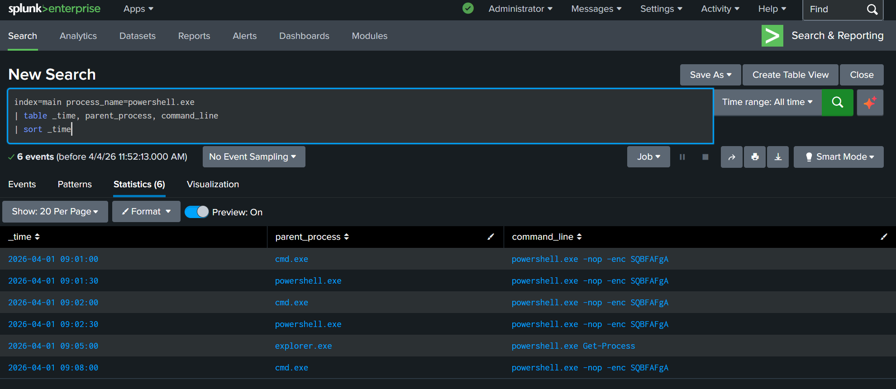
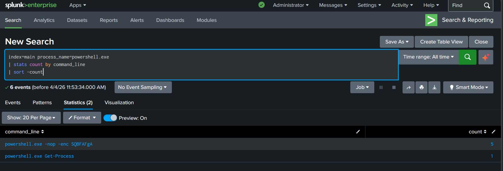

## Suspicious Process Investigation

This project demonstrates how endpoint process log analysis, in Splunk, can be used to detect suspicious PowerShell activity and potential malware execution.

### Scenario
An alert indicated unusual PowerShell execution on an endpoint. The objective was to investigate process activity and determine whether it represented malicious behavior.

### Tools Used
- Splunk (SIEM)

### Investigation Process
Details of the investigation will be documented below.

### Screenshots

#### PowerShell Execution Timeline

#### PowerShell Command Frequency

